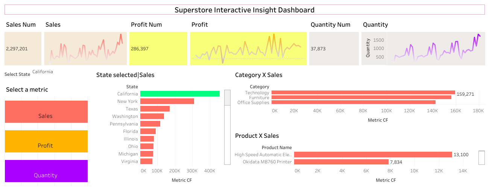

# Superstore Analysis

This project analyzes sales data from the Superstore dataset to understand
sales performance, profitability, and product trends.

The objective is to explore patterns across time, categories, products,
and regions using visual analysis.

## Dataset
- Sample Superstore dataset
- Analysis focuses on sales performance using key fields such as: sales, profit, quantity, category, sub-category, state.

## Tools Used
- Tableau

## What is analyzed
- Sales, profit, and quantity trends over time
- Category and sub-category performance
- State-wise and product-wise sales comparison
- Interactive metric-based analysis

---
Dashboard visuals and insights will be added next.

## Dashboard Preview

