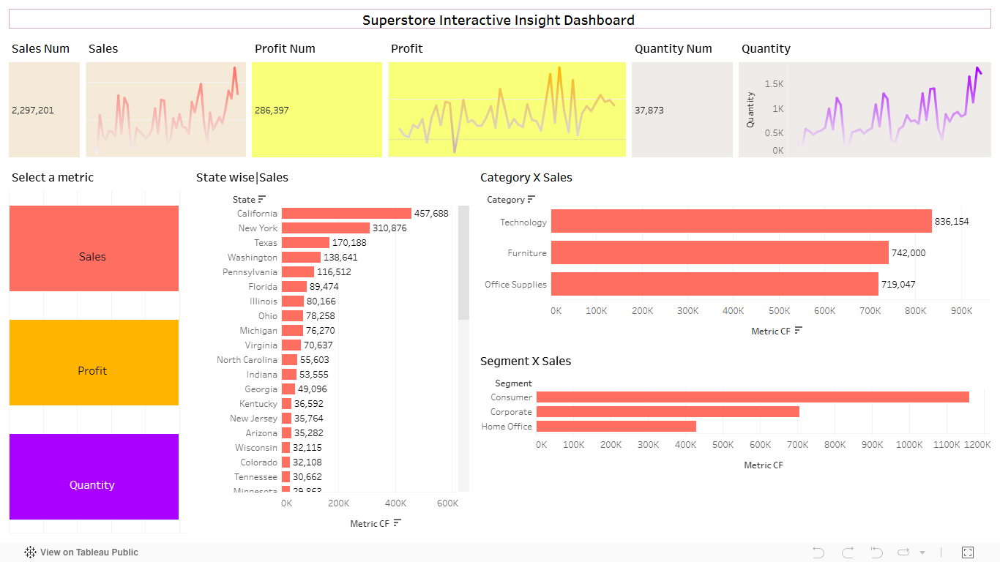

# Superstore Analysis

This project analyzes sales data from the Superstore dataset to understand
sales performance, profitability, and product trends.

The objective is to explore patterns across time, categories, products,
and regions using visual analysis.

## Dataset
- Sample Superstore dataset
- Analysis focuses on sales performance using key fields such as: sales, profit, quantity, category, sub-category, state and orderdate.

## Tools Used
- Tableau

## What is analyzed
- Sales, profit, and quantity trends over time
- Category and sub-category performance
- State-wise and product-wise sales comparison
- Interactive metric-based analysis

---
Dashboard visuals and insights will be added next.

## Dashboard Preview

## Key Insights
Technology is the top-performing category, contributing the highest share of total sales (~36%), followed by Furniture and Office Supplies, which show relatively similar contributions.

Consumer segment drives the majority of sales (over 50%), significantly outperforming Corporate and Home Office segments, indicating strong demand from individual consumers.

Sales are geographically concentrated, with California and New York contributing a disproportionately high share of total sales compared to other states.

Sales and Quantity trends show consistent growth over time, suggesting steady demand with periodic fluctuations rather than sharp volatility.

Metric comparison (Sales, Profit, Quantity) highlights that high sales volume does not always correspond to equally high profit, emphasizing the need to analyze profitability separately.

